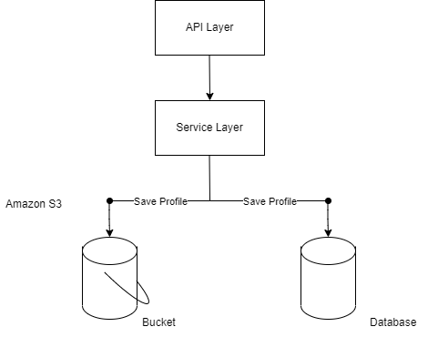

# springboot-image-upload

This is a small project that allows users to upload images that are on their devices on this Web App.
This project consist out of a front-end done in React and a backend done in springboot. The backend loads images to the Amazon S3 bucket. The code in this repository is only the backend which is spring boot with its AWS S3 components.

Below is the architecure that this project is based on.

Spring boot communicates with Amazon S3 and allows images to be uploaded in the S3 bucket.

An image of the front-end after two image has been uploaded.

